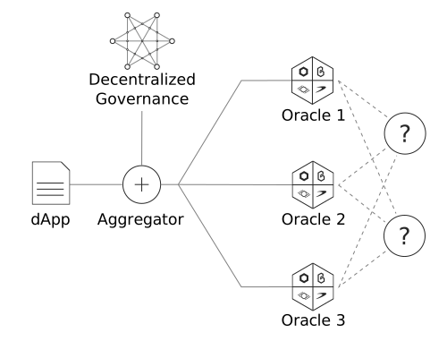

*See our article, [On DAOs: Decentralized Autonomous Organizations](https://medium.com/api3/on-daos-decentralized-autonomous-organizations-84c00abb89bc) on DAOs and decentralized governance.*

[First-party oracles](/fundamentals/first-party-oracles.md) are optimally secure and cost-efficient.
Nevertheless, they cannot be considered as a full solution for all use cases.
This is because a first-party oracle is operated by a single API provider and only serves their API.
Then, using a single first-party oracle creates centralization at the API level, and requires the API provider to be trusted.
This is not acceptable in some use cases, e.g., if the use case secures a large amount of funds.

In such cases, oracle networks provide the required decentralization.
An oracle network makes the same request to multiple independent oracles and reduces their responses to a single answer through predetermined consensus rules implemented as a smart contract called the aggregator.
Individual malicious oracles cannot manipulate the outcome of this process, which provides a degree of decentralization and trustlessness.

An important thing to consider is how the oracle network is governed. If a central entity can switch the oracles or APIs used in the aggregator in and out, or even replace the aggregator itself making use of a proxy mechanism, they can effectively manipulate the oracle network output at will. This eliminates the decentralization and trustlessness qualities that using an oracle network provides. Therefore, it is not adequate to use an oracle network for decentralization, this oracle network must be governed decentrally as well.
